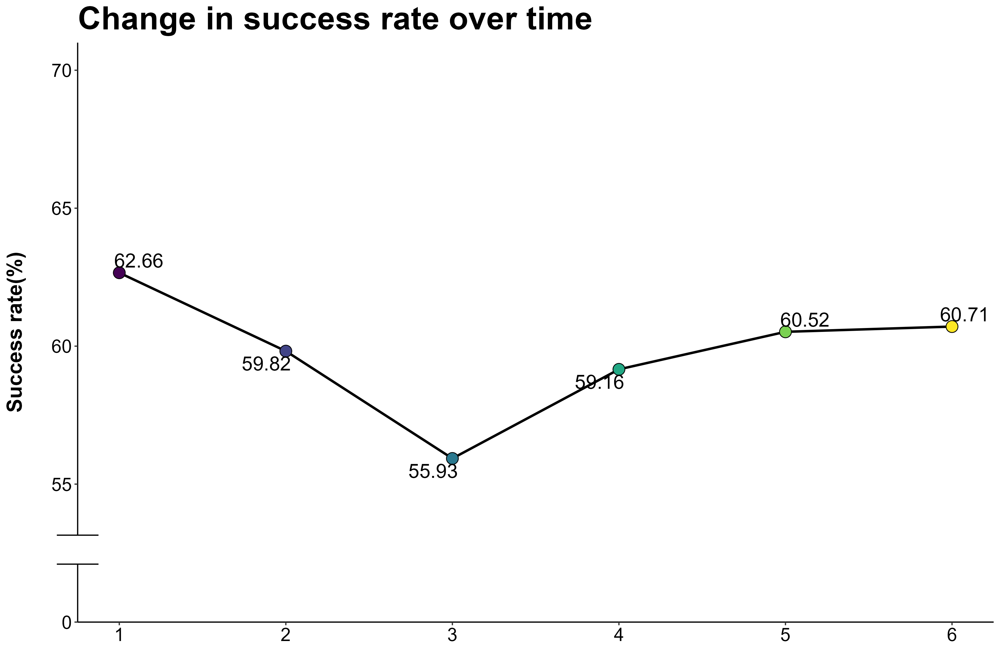

# Are success rates improving or getting worse?

trend of success rate by term

```{r setup, include=FALSE}
knitr::opts_chunk$set(echo = TRUE, comment='', warning = FALSE)
```

## Set up and load data

```{r include=FALSE}
rm(list =ls())
library(pacman)
p_load(tidyverse, ggplot2, ggrepel,cowplot, ggtext, grid, gridExtra)
load("D:/R/data analysis/Institutional research/technical-exercise/content.en/docs/questions/data_230214_1659.Rdata")
```

## Visualize the trend of success rate

```{r}
p <- course_enrollments %>%
  group_by(term_code) %>%
  count(success) %>%
  mutate(
    precent = round(100*n/sum(n),2)
    ) %>%
  filter(success == "Y") %>%
  ungroup() %>%
  ggplot(
    aes(
      x= term_code, 
      y = precent
      )
    ) +

  geom_line(size = 1, color = "black") +
  geom_point(
    aes(
      fill = term_code
      ),
      shape = 21, 
      size = 4.5, 
    show.legend = F) +
  expand_limits(y = 0) +
  geom_text_repel(
    aes(
      label = precent
      ), 
    size = 6, 
    point.padding = .2) +
  scale_x_continuous(
    breaks = seq(1,6, by = 1)
  ) +
  scale_y_continuous(
    limits = c(50,70),
    breaks = seq(50,70, by= 5),
    labels = c(0,seq(55, 70, by =5)),
    expand = c(0,0,0.05,0)
  ) +
  labs(
    x = "",
    y = "Success rate(%)\n",
    title = "Change in success rate over time"
  ) +
  scale_fill_viridis_c() +
  scale_alpha_discrete('Success rate') +
  theme_classic() +
  theme(
        legend.position = "none",
        axis.title.y = element_text(face = "bold", vjust = 0.9, size = 18, family = "Oswald"),
        axis.text = element_text(colour = "black", size = 16, family = "Oswald"),
        plot.title = element_text(face = "bold", size = 28, family = "Oswald"),
        plot.caption = element_text(size = 10, family = "Ubuntu Mono")
  ) 

gt <- ggplotGrob(p)
is_yaxis <- which(gt$layout$name == "axis-l")
yaxis <- gt$grobs[[is_yaxis]]
# You should grab the polyline child
yline <- yaxis$children[[1]]
yline$x <- unit(rep(1, 4), "npc")
yline$y <- unit(c(0, 0.1, 1, 0.15), "npc")
yline$id <- c(1, 1, 2, 2)
yline$arrow <- arrow(angle = 90)
yaxis$children[[1]] <- yline
gt$grobs[[is_yaxis]] <- yaxis
# grid plotting syntax
grid.newpage(); p <- grid.arrange(gt)      

ggsave('p1.png', width = 12, height = 8, plot = p)

```




```{r}

```

```{r}
blogdown::shortcode("figure", src = '"p1.png"', alt = "Some alt text")
```

